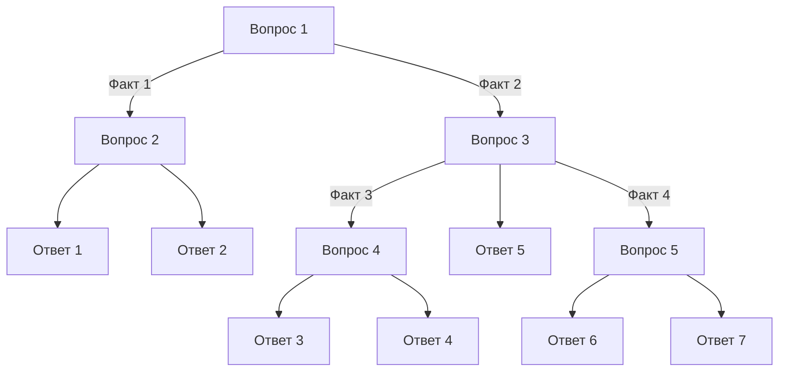

# Представление знаний в ИС - Дерновой Денис И507Б
Работы по предмету "Представление знаний в ИС"

## Практическая работа 1

### Основное задание

Вопросы: 
1.	Транспортное средство колесное (1)/ гусеничное (2)?
2.	Имеет два колеса (3) / четыре колеса и больше (4)?
3.	Основная функция пахать (5) / стрелять (6) / копать (7)?
4.	Для движения используется двигатель (8) / мускульная сила (9)?
5.	Предназначен для перевозки пассажиров (10) / грузов (11)?
Факты:
1.	Колесо
2.	Гусеницы
3.	Два
4.	Четыре
Ответы:
1.	Мотоцикл
2.	Велосипед
3.	Легковой автомобиль
4.	Грузовик
5.	Трактор
6.	Танк
7.	Экскаватор

### Дополнительное задание

Вопросы:
1.	Используется для пассажироперевозок (1) или в индустрии (2)?
2.	Красный (3) или синий (4)?
3.	Используется в строительстве (5), добыче полезных ископаемых (6) или оборонке (7)?
4.	Используется для сборки аппаратов (8) или грузоперевозок (9)?
5.	Основная боевая сила (10) или машина боевой поддержки (11)?
Факты:
1.	Пассажирный
2.	Индустриальный
3.	Строительный
4.	Военный
Ответы:
1.	Red Ship
2.	Blue Ship
3.	Constructor
4.	Cargo Ship
5.	Miner
6.	Cruiser
7.	Fighter
